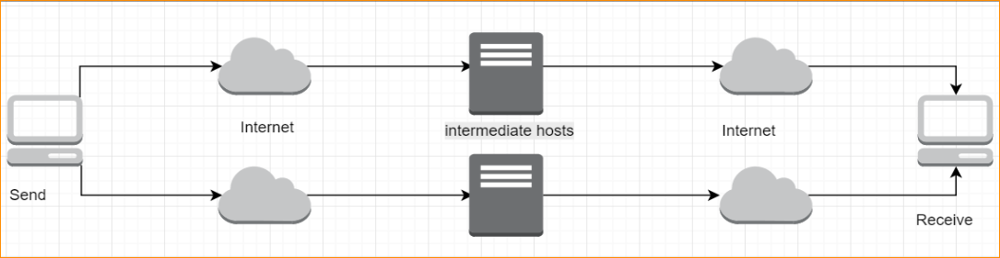

# Stream Splitting Moving Target Defense Demo

Our system relies on intermediate bouncer hosts to break up the stream between multiple routes. The research paper can be found [here](docs/SSMTD-Paper.pdf).

Ideally this would be implemented as a kernel module and would be effectively transparent to the user.  Furthermore, it would be more ideal if this were implemented by abusing TCP TTL and packet size, which would allow for disparate routing paths without the need for explicit intermediate bouncer hosts.

## Usage

### `receive.py`

The receiver should be set up on whatever host you would like to receive.

### `bouncer.py`

The bouncer should be set up on hosts in geographically disparate areas to force divergent paths.  The `hosts` list in `bouncer.py` should be populated with the final endpoint and/or other bouncers. Running the bouncer is as follows `python bouncer.py <port>`.

### `sender.py`

The sender should be run on the machine with the data you wish to send.  The `remoteHosts` list be populated with the IP addresses of the remote bouncer hosts.  To run the sender, `python sender.py <file>`.  Optionally, the size of the chunks the data will be broken into can be set using `-b`.
